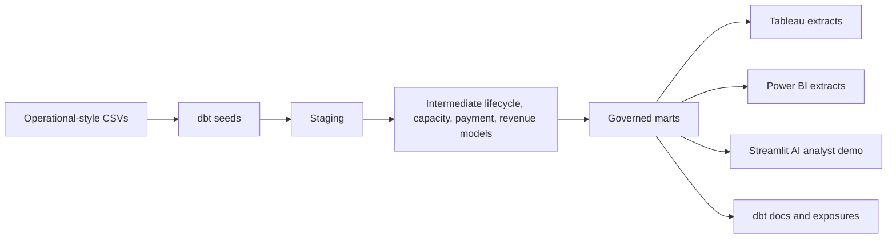

# Luxury Cruise Analytics Engineering Platform

This project simulates the analytics engineering layer of a luxury cruise company. It is locally runnable with DuckDB and dbt-duckdb, and it transforms raw reservations, payments, itineraries, cabins, marketing campaigns, and AOP targets into governed dbt marts and semantic KPI definitions powering Tableau and Power BI executive scorecards.

The platform includes a deterministic synthetic data generator, a real dbt incremental booking fact, revenue recognition and deferred revenue marts, a monthly finance revenue waterfall, dbt tests and documentation, GitHub Actions CI, exported BI-ready CSVs, Snowflake-ready SQL patterns, and a Streamlit governed analyst prototype. Snowflake deployment patterns are included, but no real Snowflake deployment is claimed without credentials.

## Why This Project Exists

Luxury cruise operators need trusted answers about recognized revenue, deferred revenue, occupancy, booking pace, cancellation exposure, and AOP attainment. This repository demonstrates how a Data Analytics Engineer can build the governed layer between raw operational systems and executive decision-making.

## Role / JD Alignment

- Snowflake-style SQL: recursive CTEs, window functions, MERGE logic, row-level security, and revenue waterfalls.
- Production dbt: staging, intermediate models, incremental marts, tests, snapshots, documentation, exposures, and CI.
- Governed data marts: executive, revenue management, finance, and marketing performance.
- Semantic KPIs: revenue, occupancy, booking pace, cancellations, AOP attainment, and ROAS.
- BI readiness: Tableau and Power BI extracts plus rebuild blueprints.
- AI-assisted analytics: documented controlled Streamlit analyst prototype and AI tooling case study.

## Implemented vs Snowflake-Ready

| Area | Implemented Locally | Snowflake-Ready / Not Claimed as Deployed |
| --- | --- | --- |
| Data generation | Deterministic Python generator creates reservations, payments, sailings, campaigns, AOP targets, and onboard spend. | Raw CSVs can be loaded to a Snowflake stage. |
| Warehouse | DuckDB database at `dbt_cruise_analytics/cruise_analytics.duckdb`. | Snowflake DDL and deployment guide are included, but no credentials are used. |
| dbt | Staging, intermediate, mart, semantic, snapshot, exposure, docs, and tests run in CI. | dbt-snowflake profile can be added for real deployment. |
| Incremental logic | `fct_booking_daily` is a real dbt incremental model using a stable booking grain. | Snowflake MERGE example shows warehouse-native implementation. |
| Finance | Sailing-level finance mart and monthly deferred revenue waterfall are implemented. | Finance logic can be extended to match a company's chart of accounts. |
| BI | Tableau and Power BI extracts and rebuild blueprints are committed. | Real workbook/screenshots are manual next steps. |
| AI analyst | Streamlit governed question menu reads exported marts. | No unrestricted AI SQL generation or Snowflake Cortex claim. |

## Architecture



## Data Model

Raw entities include guests, ships, cabins, itineraries, sailings, reservations, payments, marketing campaigns, AOP targets, and onboard spend. The generated data covers 2024-2026 with deterministic edge cases: organic bookings without campaigns, cancellations with refunds or penalties, late booking patterns, underperforming itineraries, high-performing regions, and loyalty-tier differences.

## dbt Lineage Overview

- `models/staging`: typed, cleaned source models.
- `models/intermediate`: reservation lifecycle, payment events, revenue events, capacity, booking lead-time, campaign attribution, and date spine.
- `models/marts`: dimensions, incremental daily booking fact, occupancy and recognition facts, executive scorecard, revenue management, finance revenue, monthly finance waterfall, and marketing performance.
- `snapshots`: reservation status tracking.
- `tests`: business-rule and relationship checks.
- `models/semantic`: semantic-layer-style KPI definitions.

## Key Marts

- `mart_executive_scorecard`: monthly region and ship-class KPIs vs AOP.
- `mart_revenue_management`: sailing-level occupancy gap and booked revenue.
- `mart_finance_revenue`: cash, recognized revenue, deferred revenue, refunds, and cancellation penalties.
- `mart_finance_revenue_waterfall_monthly`: monthly deferred revenue roll-forward by accounting month, region, and ship class.
- `mart_marketing_performance`: campaign contribution, ROAS, and cancellation exposure.

## Metric Definitions

See `docs/metric_definitions.md`. The most important rule is that recognized revenue is tied to sailing completion, not payment date. Occupancy uses sold passenger nights over available passenger nights.

## Snowflake SQL Capabilities Demonstrated

The `snowflake/sql_examples` folder includes:
- Recursive date spine.
- Booking pace with window functions.
- Incremental MERGE for booking daily facts.
- Revenue recognition waterfall.
- Row-level security policy example.
- Performance tuning notes.

## Tableau and Power BI Assets

The dashboard folders include blueprint documents, data source mappings, and exported extracts after running `scripts/export_bi_extracts.py`. These are BI-ready assets, not fabricated dashboard screenshots.

## Streamlit AI Analyst Demo

Run:

```bash
streamlit run streamlit_app/app.py
```

The app supports governed questions about AOP underperformance, occupancy gaps, cancellation rates, deferred revenue, and campaign ROAS. It includes a reporting month selector and displays the metric definition, query logic, table, and chart.

## How To Run Locally

```bash
python -m venv .venv
source .venv/bin/activate
pip install -r requirements.txt
python scripts/generate_synthetic_cruise_data.py
python scripts/validate_generated_data.py
cd dbt_cruise_analytics
cp profiles.example.yml profiles.yml
dbt deps --profiles-dir .
dbt build --profiles-dir .
dbt docs generate --profiles-dir .
cd ..
python scripts/export_bi_extracts.py
python -m pytest
```

If the dbt CLI is not installed in a local review environment, run the SQL smoke-build helper after generating data:

```bash
python scripts/local_duckdb_smoke_build.py
python scripts/export_bi_extracts.py
```

This helper validates model SQL and singular business-rule tests in DuckDB, but it does not replace dbt docs, snapshots, or lineage.

## How To Deploy To Snowflake

Use `snowflake/deployment_guide.md` and the SQL examples as a deployment template. This repository does not claim real Snowflake deployment because no warehouse credentials are included.

## CI/CD

GitHub Actions installs dependencies, generates data, validates data, runs dbt deps/debug/build/docs, exports BI extracts, and checks Streamlit syntax.

## Data Quality Checks

Checks include primary key uniqueness, relationship integrity, accepted statuses, passenger counts, cancellation dates, AOP coverage, return dates after departure, final payments before departure, positive AOP targets, nonnegative recognized revenue, nonnegative deferred revenue, nonnegative campaign ROAS, and occupancy rates/gaps bounded between 0 and 100%.

## Screenshots Placeholders

`docs/screenshots` is reserved for real screenshots after Tableau, Power BI, or Streamlit views are created locally. Fake screenshots are intentionally not committed.

## Resume Bullets

- Built a production-style dbt analytics platform for luxury cruise revenue, occupancy, booking pace, and AOP reporting using DuckDB locally and Snowflake-ready SQL patterns.
- Modeled governed finance and revenue-management marts with passenger-night occupancy denominators, sailing-based revenue recognition, deferred revenue, monthly roll-forward waterfalls, and cancellation exposure.
- Implemented an incremental dbt booking fact, mart-level tests, snapshots, semantic KPI documentation, BI extracts, GitHub Actions CI, and a controlled Streamlit analyst demo for executive questions.

## Future Improvements

- Add real Tableau workbook and Power BI `.pbix` files after manual dashboard build.
- Add dbt-snowflake profile and environment-specific CI once credentials are available.
- Expand onboard spend into a dedicated revenue mart.
- Add Great Expectations or Soda checks for source freshness and anomaly monitoring.
