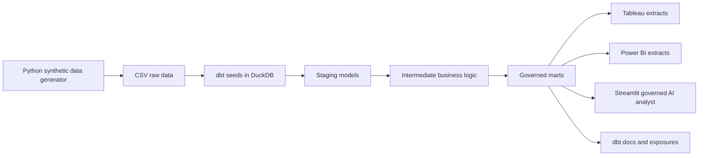

# Architecture

The local platform uses DuckDB for reproducibility. The model design mirrors a Snowflake deployment: raw ingestion, cleaned staging, reusable intermediate models, governed marts, semantic metrics, and downstream BI extracts.
