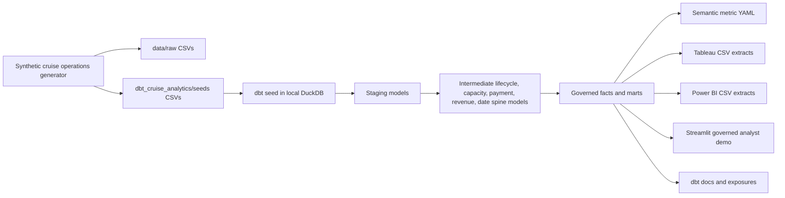
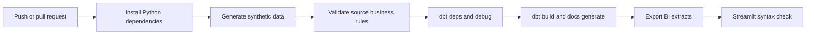

# Architecture

## Local Runnable Path

The project is designed to run locally with DuckDB and dbt-duckdb:

1. `scripts/generate_synthetic_cruise_data.py` creates deterministic raw data and dbt seed CSVs.
2. `dbt seed` loads CSVs into `dbt_cruise_analytics/cruise_analytics.duckdb`.
3. dbt builds staging, intermediate, mart, semantic time-spine, and snapshot assets.
4. `scripts/export_bi_extracts.py` exports governed marts for Tableau and Power BI.
5. `streamlit_app/app.py` reads exported mart CSVs for governed business questions.

When dbt is unavailable in a local review environment, `scripts/local_duckdb_smoke_build.py` compiles dbt-style refs and validates the model SQL plus singular business-rule tests. It is a smoke test, not a replacement for dbt docs or snapshots.

## Snowflake-Ready Path

The same structure maps to Snowflake:

- Raw CSVs land in a Snowflake stage and raw schema.
- dbt staging models type and normalize source data.
- Intermediate models centralize lifecycle, recognition, payment, and occupancy logic.
- Incremental marts use a stable grain and can compile to Snowflake MERGE semantics.
- Row access policy examples show how regional dashboard security would be applied.
- Tableau and Power BI connect to governed marts or exported extracts.

No real Snowflake deployment is claimed without credentials.

## CI/CD Flow

## Lineage Explanation

- `reservations`, `sailings`, `cabins`, and `itineraries` feed `int_reservation_lifecycle`.
- `payments` and lifecycle data feed cash and finance models.
- Completed reservations feed `int_revenue_events` and `fct_revenue_recognition`.
- Capacity and date spine feed `fct_occupancy_daily`.
- AOP targets join with revenue, occupancy, and booking facts in `mart_executive_scorecard`.
- `mart_finance_revenue_waterfall_monthly` rolls payment and recognition activity into beginning and ending deferred revenue.
